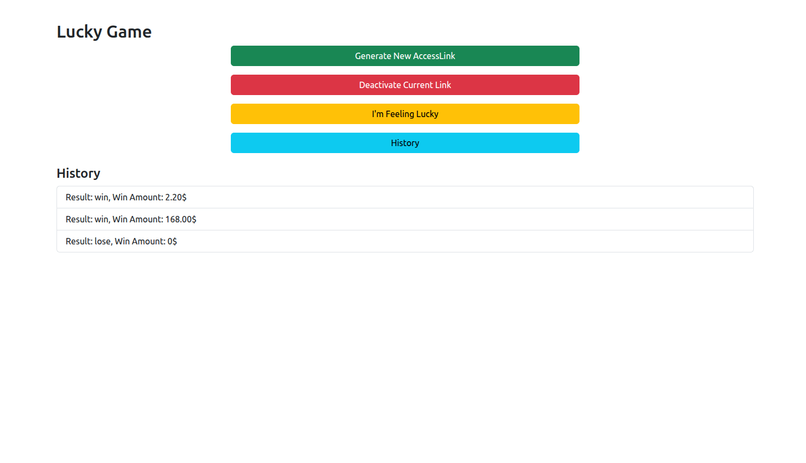
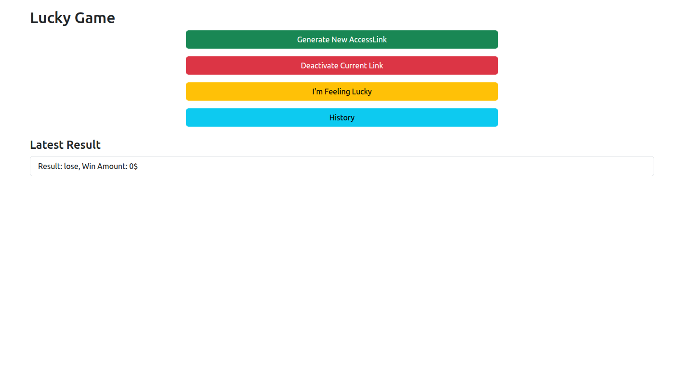
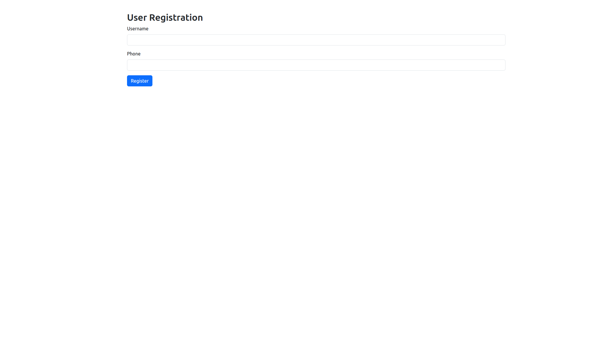

# LaravelTestTask

## Quick Start

1. **Clone the repository:**
   ```bash
   git clone https://github.com/Nvgdsk/LaravelTestTask.git
   cd LaravelTestTask
   ```

2. **Copy Docker environment file:**
   ```bash
   cp .env.example .env
   ```

3. **Go to Laravel app directory:**
   ```bash
   cd laravel
   ```

4. **Copy Laravel environment file:**
   ```bash
   cp .env.example .env
   ```

5. **Modify environment files if needed:**
   - If you change any variables (e.g., ports, DB credentials) in the Docker `.env`, you must also update them in the Laravel `.env` file to match.

6. **Build and start containers:**
   ```bash
   docker compose up -d
   ```
   ```bash
   docker exec -it laravel_app  php artisan migrate
   ```

7. **Access the app:**
   - Open your browser and go to the URL specified in your `.env` and `docker-compose.yml` (e.g., `http://localhost:8007`).

## Useful Images




## GitHub Upload
To upload your project to GitHub:
```bash
git init
git add .
git commit -m "Initial commit"
git remote add origin https://github.com/your-username/your-repo.git
git push -u origin master
```

## Laravel .gitignore
Make sure you have a `.gitignore` file with at least:
```
vendor/
.env
node_modules/
```